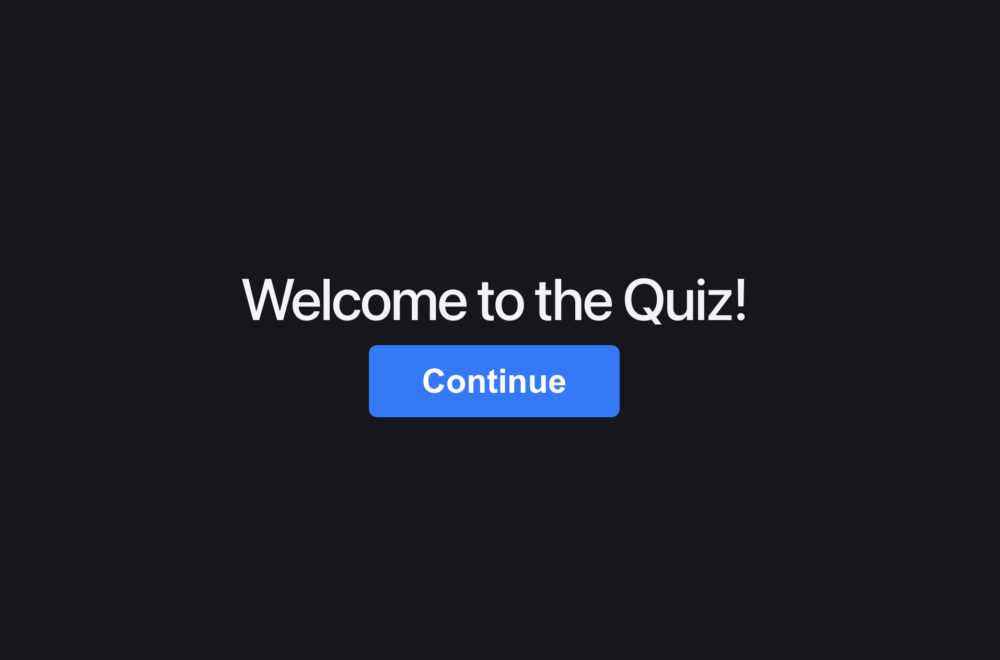
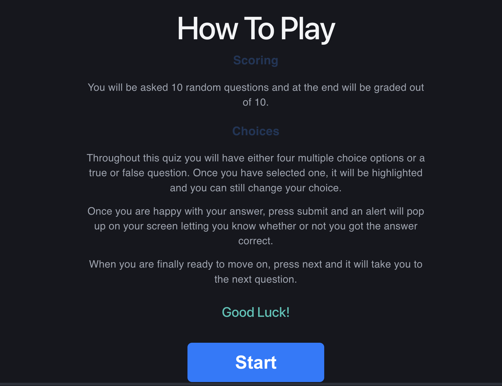
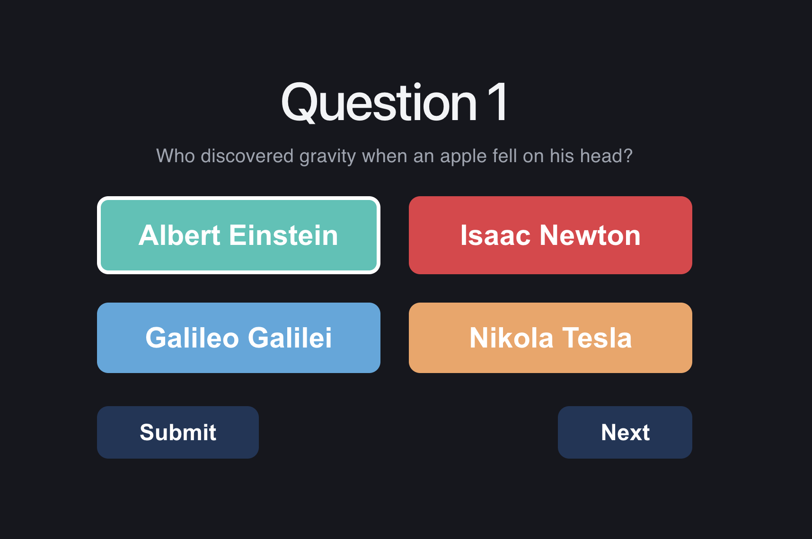
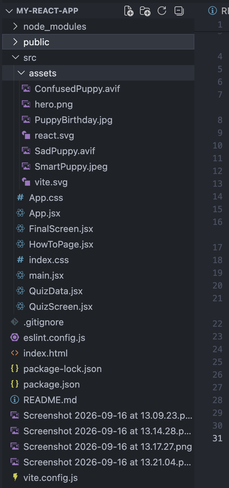

# Trivia App

A responsive, interactive web application that will test the general knowledge of users across a series of randomly generated questions. This website is built entirely using modern front-end development tools.

# Value for the user

A clean and understandable UI that welcomes players. The user is able to read comprehensive game rules and test their knowledge with both multiple choice and true and false questions. The user will also receive a tailored visual feedback depending on how they perform.

# Features

It features a clear presentation title as well as a large navigational button.

# How to Play

There is a dedicated interface designed to ensure users understand how the web application works. It breaks down the scoring, options, submission locks and navigational triggers.

# Quiz

The app renders questions in color coded quadrants using CSS. The options will highlight upon selection, lock you out upon submission and there are grey submission and next buttons.

# Performance based Scoreboard

There is a tailored results screen which will display your final score as well as a high-resolution image depending on how you go.

# Structure

Files are named consistently and descriptively named without spaces to ensure cross-platform compatibility

### Local Development Setup

To boot the local development server on your machine, you will need to install the required project module packages (npm install), and ensure you run a local testing server (npm run dev)